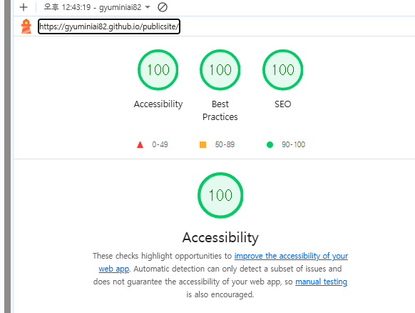

# 경기도농업기술원 웹 접근성 개선 및 리뉴얼 프로젝트

> "와우 멘트 : 경기도농업기술원 웹 접근성 강화 포트폴리오"

## 1. 프로젝트 소개

- **설명:** 정보의 양이 방대하여 검색 의존도가 높으나, 디지털 숙련도가 낮은 사용자가 검색 과정에서 겪는 인터랙션 오류로 인해 서비스 이용을 중단하는 사례가 빈번함. 특히 빈 검색어 입력 시 발생하는 불필요한 화면 전환과 로딩 지연은 인지 능력이 낮은 고령층 사용자에게 치명적인 디지털 장벽이 되고 있어
이를 개선하기 위해 기획·디자인·개발을 진행한 리뉴얼 프로젝트입니다.
- **진행 기간:** 2026.04.28 ~ 2026.05.15 (약 2주)
- **개발 인원:** 개인 프로젝트 (기여도 100%)

## 2. 배포 및 관련 링크

- **Live Demo:** <a href="https://gyuminiai82.github.io/publicsite" target="_blank">배포된 웹사이트 링크 입력</a>
- **GitHub Repository:** <a href="https://github.com/gyuminiai82/publicsite" target="_blank">깃허브 링크 입력</a>
- **Design (Figma):** <a href="https://www.figma.com/design/sG3ex19uVrhKu2jn5YLaUK/%EA%B3%B5%EA%B3%B5%EC%82%AC%EC%9D%B4%ED%8A%B8-%EA%B0%9C%EC%84%A0?node-id=110-768&t=qwJgrfQelXIw8Ciz-0" target="_blank">피그마 시안 링크 입력</a>

---

## 3. 사용 기술 스택

### Frontend

- **React.js & Vite:** 컴포넌트 기반 개발로 복잡한 공공기관 UI의 유지보수성을 높이고, 빠른 응답 속도를 구현하기 위해 사용

### Design & Tools

- **Figma:** 웹 접근성 체크리스트를 기반으로 한 UI/UX 설계 및 프로토타이핑
- **Lighthouse / Axe-core:** 웹 접근성 진단 및 품질 지표 측정을 위한 도구 활용



### AI-Assisted Development (Vibe Coding)

- **Google Gemini / Antigravity:** 시맨틱 마크업 검토, ARIA 속성 최적화, 스크린 리더 호환 로직 리팩토링을 위한 페어 프로그래밍 도구로 활용
- **AI 활용 목표:** 복잡한 공공기관의 정보 구조를 논리적인 접근성 표준에 맞춰 빠르게 재구성하고 오류를 사전에 방지

---

## 4. 사용자 작업 흐름

**주요 과업: 통합 검색 및 입력누락 피드백**

1. 메인 페이지 접근 
2. 검색진입(통합검색 버튼 클릭)
3. 입력누락 피드백
4. 검색어 입력
5. 검색 페이지 노출

---

## 5. AI 활용 및 개발 워크플로우 (Vibe Coding)

생성형 AI를 적극적으로 활용하여 접근성 표준 준수 효율을 극대화했습니다.

- **초기 구조 설계:** KWCAG 지침을 프롬프트에 반영하여, 시맨틱 태그(header, main, footer, section 등) 중심의 뼈대를 Antigravity를 통해 생성
- **코드 리팩토링:** 비정형적인 div 위주의 코드를 AI 피드백을 통해 웹 접근성에 부합하는 시맨틱 코드로 자동 변환 및 최적화
- **접근성 자동 검사:** 작성된 컴포넌트의 명도 대비(Color Contrast)와 대체 텍스트 적절성을 AI로 1차 검증하여 개발 시간 단축

---

## 6. 핵심 구현 기능

- **웹 접근성 표준 준수:** 키보드 전용 사용자, 시각 장애인(스크린 리더)을 위한 시맨틱 마크업 및 초점(Focus) 관리 최적화
- **반응형 웹 디자인(RWD):** 모바일 기기에서도 공공 서비스 이용에 불편함이 없도록 유연한 그리드 시스템 적용
- **고대비 모드 지원:** 시력이 낮은 사용자를 위한 고대비 테마(High Contrast) 전환 기능 구현

---

## 7. 디렉토리 구조

```text
src
├── assets          # 이미지
├── components      # 공통 컴포넌트 (Header, QuickLinks, SearchModal 등)
├── pages           # Home, Search 등 화면 단위 페이지
├── App.jsx         # 라우팅 및 접근성 Provider 설정
└── index.js        # React 앱 진입점
```

## 8. 회고 및 인사이트

**[기술보다 중요한 배려, 웹 접근성]**
웹 접근성을 준수한 웹사이트를 만들면서 디지털 약자의 입장에서 생각하는 법을 배웠고, 이를 통해 프론트엔드 개발자로서 한발 더 다가갈 수 있는 계기가 되었습니다.

**[AI와의 협업, Vibe Coding의 가능성]**
AI를 활용하면 기존의 코딩에 급급했던 방식에서 벗어나 더 깊이있게 고민하고 다양한 관점에서 예상하지 못했던 부분에 대한 조언을 얻을 수 있었습니다.